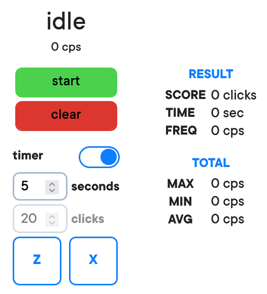

<!-- Always add something to your README.md -->
# osu! tps test
**welcome to a simple tps test with a clean look.**  

</img>  

## how to use?
to start right now, visit <a href="hinodehino.github.io">the site</a> and press **start**. you will need to spam z and x.  
as soon as you press start, the countdown will start, so make sure you are ready to spam. when you press start, idle will replace with the amount of seconds left.  

to clear all your stats, press **clear**. if you won't, they will be deleted as you close the page as the website **doesn't use cookies**.  

under that button, there is a **timer** switch. timer means you will have a certain amount of seconds you can set to spam, otherwise it will wait until you clicked a certain amount of times you can also set. you can set all these under the switch.  

under the switch, you can click **buttons** looking like keys on your keyboard to rebind - click on one of them, press any key and you're done!  

look at the right: **stats** will show you things. under **result** **score** is amount of clicks you've done, time is amount of seconds has passed and freq is your result.  

in the **total** tab, there is **max**imum amount of cps, **min**imum amount of cps and **avg** - average amount of cps.
